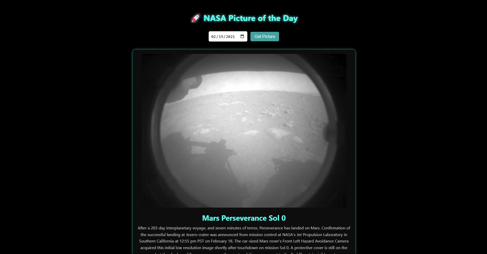

# 🌌 NASA Daily Picture UI

A simple yet powerful project where users can view NASA's Astronomy Picture of the Day (APOD). The app lets users input a date, and it fetches the corresponding image, title, and detailed explanation using the NASA APOD API.

🛠 **Tech Stack / Frameworks Used**
- HTML/CSS/JavaScript
- Fetch API
- NASA APOD API
- Vanilla JS DOM Manipulation

⚙️ **How It Works**
1. **User Input**: The user selects a date via a date picker.
2. **API Call**: The app fetches the Astronomy Picture of the Day from NASA’s API, based on the selected date.
3. **Display**: The image, title, and explanation of the picture are displayed dynamically on the page.

📚 **What I Learned**
- How to integrate a third-party API into a web project.
- Handling user input and dynamically updating the DOM based on API responses.
- Working with asynchronous JavaScript using `fetch()` and `.then()`.
- Error handling in cases of invalid dates or no image media.
- Improving my JavaScript skills with real-time data fetching and DOM manipulation.

😊 **My Experience**
This project was a lot of fun! It gave me hands-on experience working with public APIs and allowed me to dive deeper into asynchronous JavaScript. Debugging issues with API requests and parsing the response taught me a lot about real-world data fetching. Seeing the beautiful NASA images change as I selected different dates made the project even more exciting!

📸 **Screenshot**
Here’s a preview of the NASA Daily Picture UI:

🚀 **How to Run**
1. Clone the repo:
   
   git clone https://github.com/yourusername/nasa-daily-pic.git
